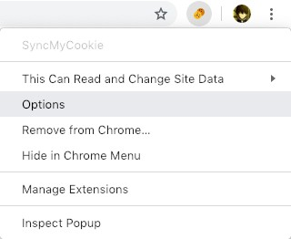
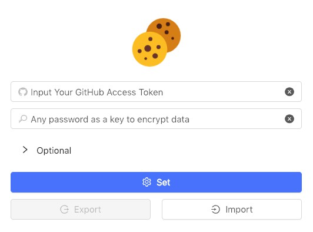
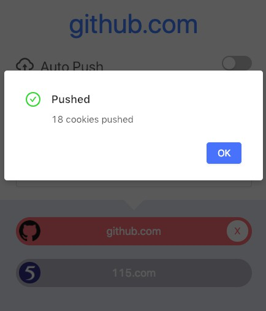
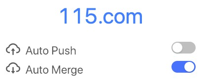
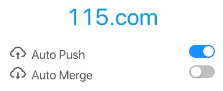
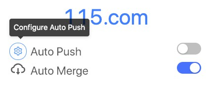

# SyncMyCookie
[English](https://github.com/Andiedie/sync-my-cookie/blob/master/README.md) | [中文](https://blog.andiedie.cn/posts/abbd/)

SyncMyCookie is a chrome extension to synchronize your cookies.

You can specify to sync cookies for any website, configure rules for `Auto Merge` and `Auto Push`.

## Install
- Recommended: [Chrome Web Store](https://chrome.google.com/webstore/detail/syncmycookie/laapobniolmbhnkldepjnebendehhmmf)
- [SyncMyCookie.crx](https://github.com/andiedie/sync-my-cookie/releases/download/v2.0.0/crx.zip)
- [Pre Built](https://github.com/andiedie/sync-my-cookie/releases/download/v2.0.0/pre-built.zip)

  Enable the `Developer mode` in the Chrome Extension(`chrome://extensions`) and load it via `Load Unpacked`.
  
- Build from Source

  ```bash
  git clone https://github.com/Andiedie/sync-my-cookie.git
  cd sync-my-cookie
  yarn            # npm install
  yarn build      # npm run build
  ```
  And load folder `build` just like the above method.

## Scenes to be used
### Avoid frequent logins
Some cookies that remain login status will expire when the browser is closed, which causes us to log in frequently.

You can save the cookies of this website after login and enable `Auto Merge`. This way, even if the browser is closed, the login status of the website will not disappear.

### Share account
Maybe you have the following requirements:
- Share account with friends
- Break the limit of single sign-on
- Sync login status across multiple browsers

Using SyncMyCookie can easily meet the above requirements.

You can log in on one browser and enable `Auto Push`. On other browsers, enable `Auto Merge` so your login status will sync across these browsers.
  
## Configuration
In order to share cookies across devices, this extension encrypts your cookies and save them in Gist, which requires you to have a GitHub account.

If you have suggestions for using other types of storage to save data, please create an issue [here](https://github.com/Andiedie/sync-my-cookie/issues).

### Generate GitHub Access Token
GitHub Access Token (token for short) allows the extension to modify your Gist. You can generate a new token [here](https://github.com/settings/tokens/new).

**Attention:**


SyncMyCookie only needs Gist scope, so please don't check other unnecessary scopes for your account security.

### Configure Extension
Right click on the extension and click on `Options`.



Input your token and a password to encrypt data.



Now feel free to use this extension.

Note: If ignoring the optional `Gist ID` and `Filename` fields, this extension creates a brand new Gist to store the data. If you want to synchronize cookies between two browsers, the extensions on both browsers must have the same configuration, namely the four fields `GitHub Access Token`, `password`, `Gist ID` and `Filename` must be identical. The plugin provides the ability to import and export configurations to help you get the job done.

## Usage
### Push cookies
To push your cookies for specific website to gist storage, just open this extension while browsing that website and click `Push`.



### Merge cookies
To read saved cookies for specific website from gist and make chrome take them, just select that website from list and click `Merge`.


### Auto Merge
When the `Auto Merge` feature is turned on for a given site, the extension automatically reads the saved cookies of the site from Gist and merge them **each time the browser is opened**.



When the browser starts, you can see a red badge on the extension indicating the number of websites that successfully perform `Auto Merge`.


### Auto Push
When the `Auto Push` feature is turned on for a given site, the extension automatically push the cookies of the site to Gist **when they change**.



You can see a green badge on the extension indicating the number of websites that successfully perform `Auto Push`.


#### Configure Auto Push
Usually, only a few values in cookies are critical. Configuring `Auto Push` rules allows the extension to perform `Auto Push` only when the specified value is updated.

Hover over the `Push` icon and click the configuration button that appears.



Select or input any name that you want to `Auto Push` when they change:


## Security
Since cookies are a very important security credential, please use this extension very carefully.

By using `HTTPS` and `AES-128-CBC`, this extension guarantees that your cookies are safe during the transfer and storage process, but you still need to be aware of the following:

- To keep your cookies safe, please don't disclose your configuration, especially your password. This will cause your cookies to be completely exposed to others.
- This extension guarantees that only the Gist scope of the GitHub Access Token will be used. To prevent potential security issues, please only check Gist scope when generating token.
- In theory, multiple devices using the same cookie can use some services at the same time, but this is related to the service provider's detection mechanism. So the risk of using this extension for account sharing is uncertain.

## LICENSE
MIT